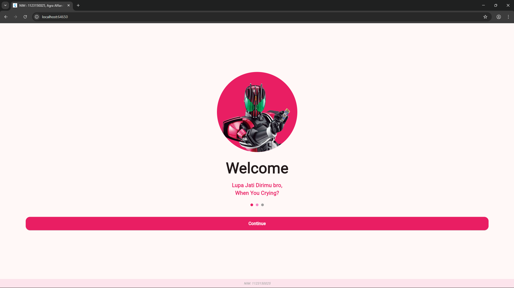
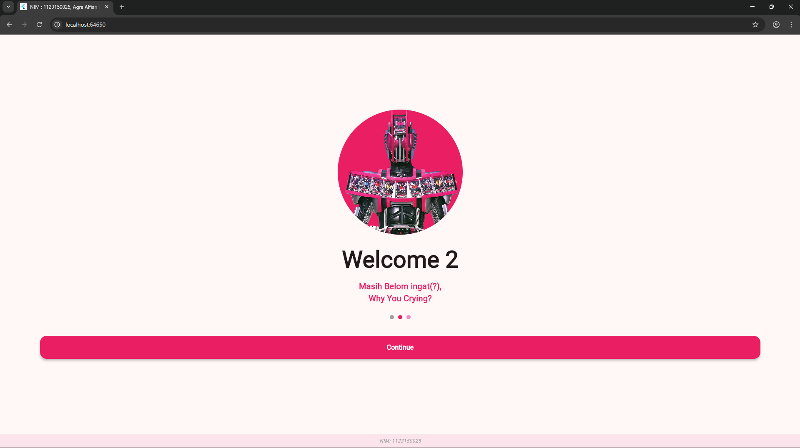
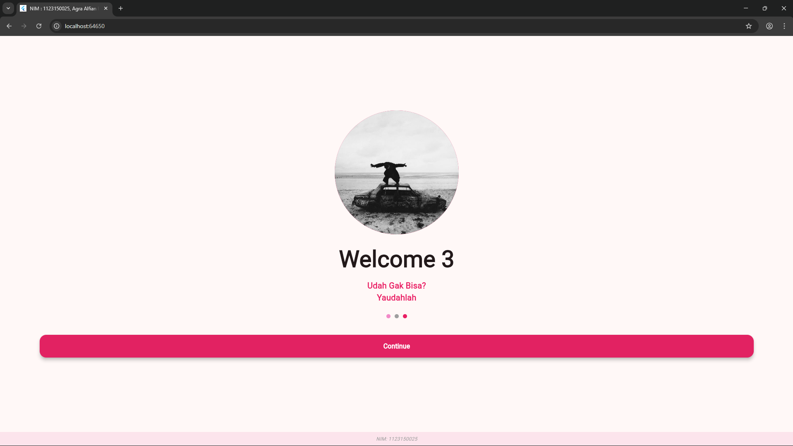
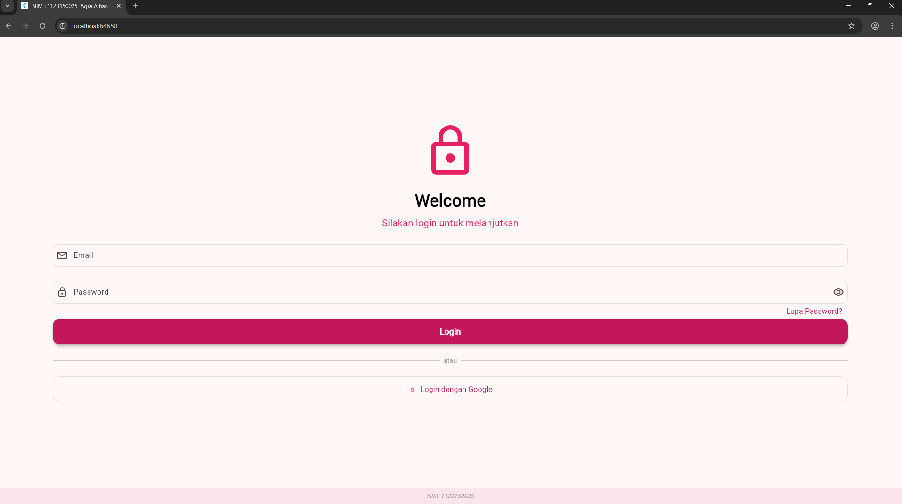
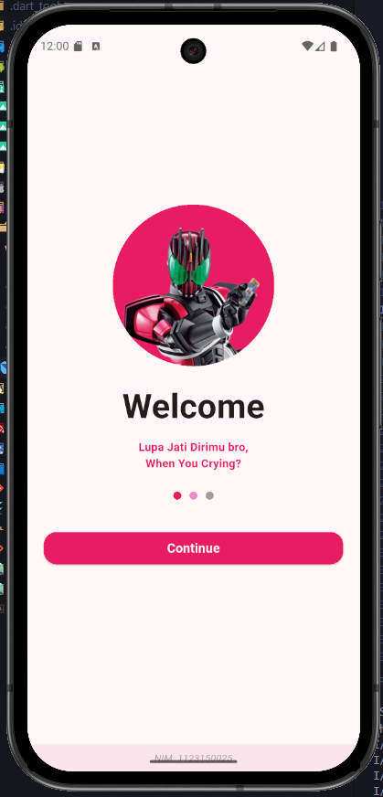
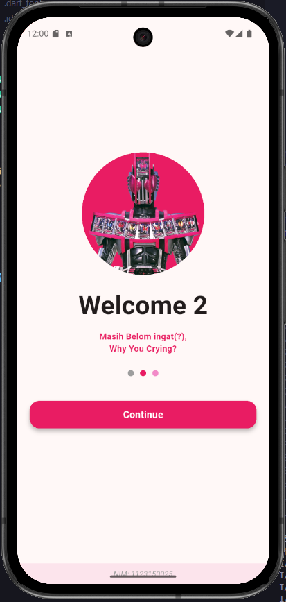
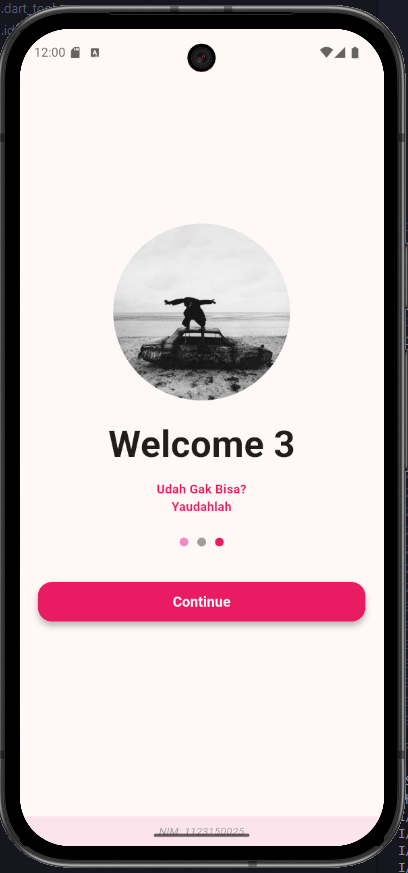
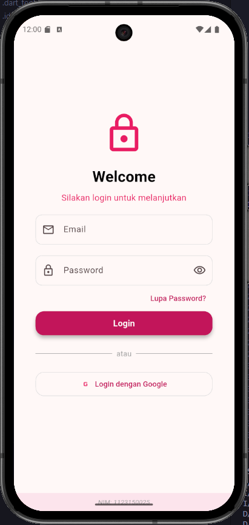
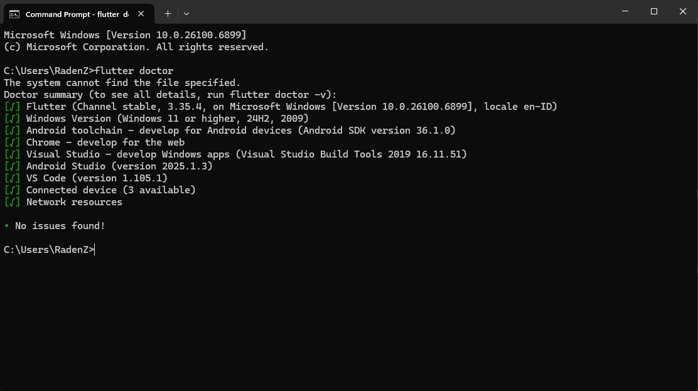

# 📱 UTS Flutter - Halaman Login Responsive


---

## 📸 Screenshot Hasil

### 🖥️ Tampilan Desktop
Berikut hasil tampilan pada **perangkat Desktop**:

| Tampilan 1 | Tampilan 2 |
|-------------|-------------|
|  |  |
|  |  |

---

### 📱 Tampilan Phone
Berikut hasil tampilan pada **perangkat Mobile (Phone)**:

| Tampilan 1 | Tampilan 2 |
|-------------|-------------|
|  |  |
|  |  |

---

## 👤 Identitas
- **Nama Lengkap:** Agra Alfian Hafiz  
- **NIM:** 1123150025  

---

## 🚀 Cara Menjalankan Project

### 🧩 1️⃣ Persiapan
Pastikan sudah menginstall:
- [Flutter SDK](https://docs.flutter.dev/get-started/install)
- Android Studio / VS Code
- Emulator Android ATAU aktifkan mode *Developer* dan *USB Debugging* di HP kamu

---

### 💻 2️⃣.1️⃣ Jalankan di **VS Code**

1. **Lakukan Git Clone** pada repository berikut:
   ```bash
   git clone https://github.com/agrahafiz13/KB1179-1123150025-uts-.git

2. Sebelum buka foldernya cek terlebih dahulu di terminal dan pastikan sudah menginstal dependency:
    
3. Buka Hasil Clone dari Repo yang sudah di ambil sebelumnya dengan Visual Studio Code / Android Studio
4. Di Terminal lakukan perintah seperti berikut ini :
    - flutter pub get
    - flutter run

### 2️⃣.2️⃣ Jalankan Perintah di Terminal dengan Android Studio
* Lakukan hal yang sama pada sebelumnya
- A. Jalankan lewat Android Studio
    Buka Android Studio → tab Device Manager
    Buat atau jalankan Android Virtual Device (AVD)
    Setelah emulator aktif, buka project di Android Studio atau VS Code
- B. Jalankan perintah: 
    flutter run -d emulator-5554 
    *(ganti emulator-5554 sesuai nama emulator dari hasil flutter devices)

### 3️⃣ Cek Devices yang Tersambung
flutter devices

### 4️⃣ Jalankan Aplikasi
flutter run

### ⚙️ 5️⃣ Perintah Umum

| 🧩 **Tujuan** | 💻 **Perintah** |
|---------------|----------------|
| Mendapatkan dependency | `flutter pub get` |
| Menjalankan project | `flutter run` |
| Menjalankan di device tertentu | `flutter run -d <device_id>` |
| Melihat daftar device | `flutter devices` |
| Membersihkan build lama | `flutter clean` |

✨ **Kelebihan versi ini dan 📋 Penjelasan tambahan::**
- README ini sudah mendukung **semua mode (Windows Desktop, Chrome, dan Android)**.  
- Kamu cukup menyesuaikan nama file screenshot di bagian atas.  
- Simpan file ini sebagai `README.md` di root project.  
- Sudah lengkap semua mode (Windows, Chrome, Android)
- Ada badge otomatis yang tampil keren di GitHub
- Ada ikon per platform (🖥️ 🤖 🌐)
- Bagian *Catatan & Kendala* tampil menarik dan mudah dibaca  

## 💖 Terima Kasih!

> Terima kasih sudah melihat project ini!  
> Semoga project ini bermanfaat dan bisa jadi inspirasi buat teman-teman yang sedang belajar Flutter 💫  

<div align="center" style="background-color:#1e1e2e; padding:20px; border-radius:12px;">
  <br/>
  <b style="color:#ffb6c1;">(´｡• ᵕ •｡`) ♡ Arigatou~!</b>
</div>
